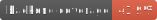
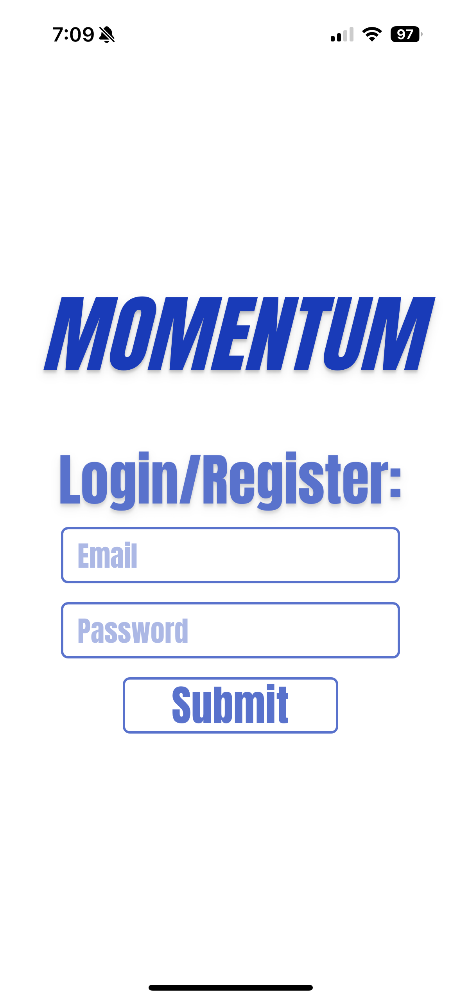
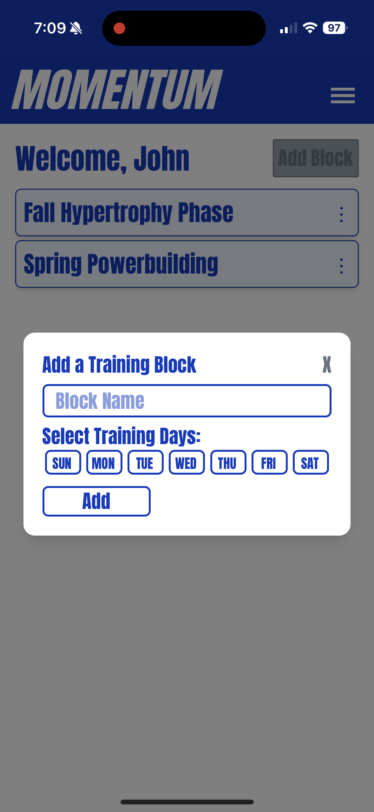
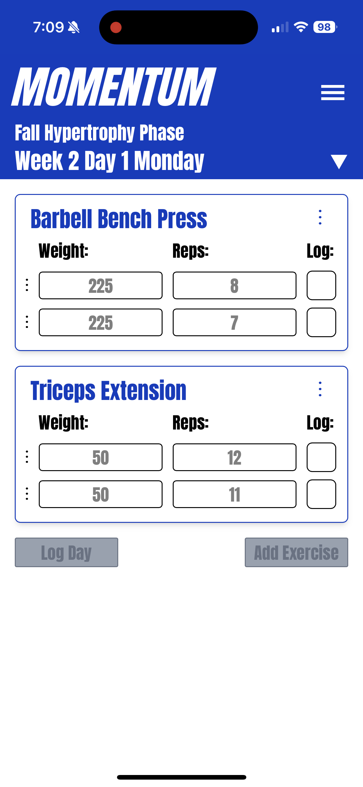
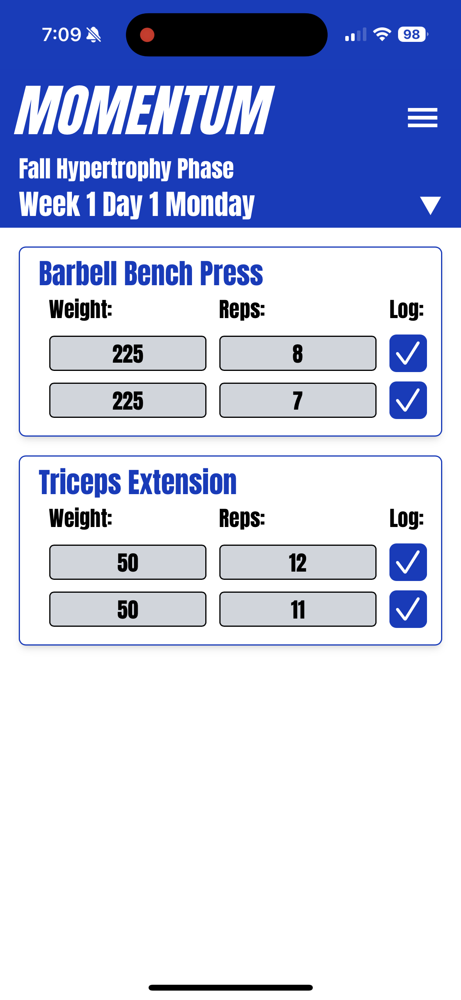
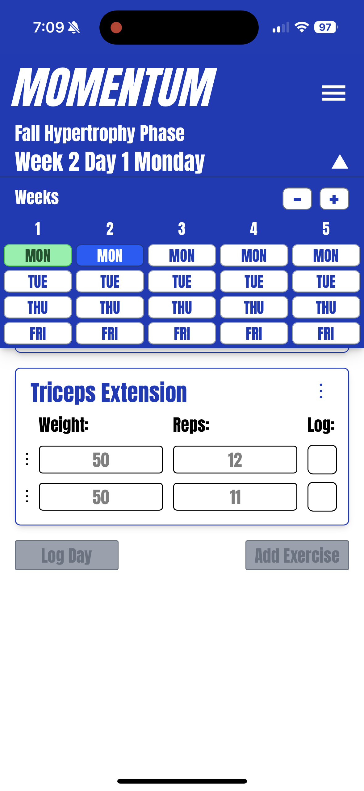

# Momentum 
 

Momentum is a full-stack web app that allows users to log their strength training workouts. It is built with Java Spring Boot, React, and MongoDB. Users can plan and create training blocks, log workouts by week and day, and record exercises with detailed set data including reps and weights.

---
## Deployment Platforms (No longer deployed)

- [Render](https://render.com/) for Backend (via Dockerfile)
- [Netlify](https://www.netlify.com/) for Frontend

---

## Tech Stack

### Backend
- **Java Spring Boot**: Used to build scalable and maintainable RESTful services
- **REST APIs**: The backend exposes RESTful endpoints that follow standard HTTP conventions
- **Docker**: The application runs in Docker containers to ensure consistent development and deployment environments

### Frontend
- **React**: The UI is built with React using JSX for fast updates and dynamic rendering
- **Tailwind CSS**: Tailwind is used for styling, allowing for responsive design and consistent UI

### Database
- **MongoDB**: MongoDB is accessed through Spring Data’s repository abstraction

### Testing and CI
- **Unit Testing**: Backend is tested using `@SpringBootTest` to validate services and controllers
- **Code Coverage**: JaCoCo is used to generate backend test coverage reports
- **CI with GitHub Actions**: Coverage badge is updated in real-time via a GitHub Action workflow

---

## Personal Deployment

To run Momentum locally, follow the instructions for your operating system below:

### Windows Setup

**1. Clone the Repository**

```powershell
git clone https://github.com/j-mikolajczyk/momentum.git
cd momentum
```

**2. Set Up Environment Variables**

Copy the example ```.env``` files:

```powershell
copy backend\src\main\resources\.env.example backend\src\main\resources\.env
copy frontend\.env.example frontend\.env  
```

Open the ```.env``` file and fill in the necessary configuration values (e.g., MongoDB URI, username, password, etc.).

**3. Run the Backend**

- Open a terminal in the ```backend``` directory.
- Run the Spring Boot application using Maven:

```powershell
cd backend
./mvnw spring-boot:run
```

**4. Run the Frontend**

- Open a new terminal window.
- Navigate to the ```frontend``` directory.
- Install depencencies and run:
  ```powershell
  cd frontend
  npm install
  npm run dev
  ```

### Linux/MacOS Setup

**1. Clone the Repository**

```
git clone https://github.com/j-mikolajczyk/momentum.git
cd momentum
```

**2. Set Up Environment Variables**

Copy the example ```.env``` files:

```
cp backend/src/main/resources/.env.example backend/src/main/resources/.env
cp frontend/.env.example frontend/.env
```

Open the ```.env``` file and fill in the necessary configuration values (e.g., MongoDB URI, username, password, etc.).

**3. Run the Backend**

- Open a terminal in the ```backend``` directory.
- Run the Spring Boot application using Maven:

```powershell
cd backend
./mvnw spring-boot:run
```

**4. Run the Frontend**

- Open a new terminal window.
- Navigate to the ```frontend``` directory.
- Install depencencies and run:
  ```
  cd frontend
  npm install
  npm run dev
  ```
---

## Project Structure

```bash
momentum/
├── backend/                # Java Spring Boot backend
│   ├── src/
│   ├── Dockerfile
│   └── pom.xml
├── frontend/               # React frontend
│   ├── public/
│   ├── src/
│   └── package.json
└── README.md

## Screenshots

Below are screenshots demonstrating key features of Momentum.

Login Page	
Add New Block	
Unlogged Sets	
Logged Sets	
Week Menu	
